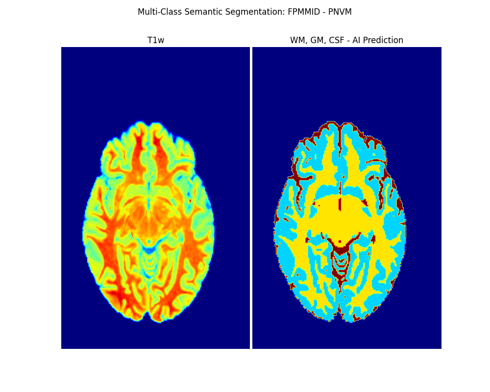

# pl-fpmmid


[](https://hub.docker.com/r/fnndsc/pl-fpmmid)
[](https://github.com/FNNDSC/pl-fpmmid/blob/main/LICENSE)
[](https://github.com/FNNDSC/pl-fpmmid/actions/workflows/ci.yml)


# Federated Prediction Models for Medical Imaging Data (FPMMID)


## Description
FPMMID will provide federated Machine-Learning and Deep-Learning
 based Prediction Models for a myriad collection of Medical 
Imaging data from various Data Acquisition systems across 
the hospital. Currently, FPMMID provides fast-response predictive
 4-layer 3D segmentation of individual TW1 MR imaging scans. 
FPMMID is currently being tested with the PING (Pediatric Imaging, 
Neurocognition, and Genetics Data Repository) dataset 
(paper link: https://www.ncbi.nlm.nih.gov/pmc/articles/PMC4628902/pdf/nihms691152.pdf  

`pl-fpmmid` is a [_ChRIS_](https://chrisproject.org/)
_ds_ plugin that wraps around FPMMID.

## Installation

`pl-fpmmid` is a _[ChRIS](https://chrisproject.org/) plugin_, meaning it can
run from either within _ChRIS_ or the command-line.

[](https://chrisstore.co/plugin/pl-appname)

## Local Usage

To get started with local command-line usage, use [Apptainer](https://apptainer.org/)
(a.k.a. Singularity) to run `pl-fpmmid` as a container:

```shell
singularity exec docker://fnndsc/pl-fpmmid fpmmid [--args values...] input/ output/
```

To print its available options, run:

```shell
singularity exec docker://fnndsc/pl-fpmmid fpmmid --help
```

## Examples

`fpmmid` requires two positional arguments: a directory containing
input data, and a directory where to create output data.
First, create the input directory and move input data into it.

```shell
mkdir incoming/ outgoing/
mv P0997_t1w.nii.gz  incoming/
singularity exec docker://fnndsc/pl-fpmmid:latest fpmmid -i P0997_t1w.nii.gz incoming/ outgoing/
```

## Development

Instructions for developers.

### Building

Build a local container image:

```shell
docker build -t localhost/fnndsc/pl-fpmmid .
```

### Running

Mount the source code `fpmmid.py` into a container to try out changes without rebuild.

```shell
docker run --rm -it --userns=host -u $(id -u):$(id -g) \
    -v $PWD/fpmmid.py:/usr/local/lib/python3.6/dist-packages/fpmmid.py:ro \
    -v $PWD/in:/incoming:ro -v $PWD/out:/outgoing:rw -w /outgoing \
    localhost/fnndsc/pl-fpmmid fpmmid -i P0997_t1w.nii.gz /incoming /outgoing
```

### Testing

Run unit tests using `nosetests`.
It's recommended to rebuild the image to ensure that sources are up-to-date.

```shell
docker build -t localhost/fnndsc/pl-fpmmid:dev .
docker run --rm -it localhost/fnndsc/pl-fpmmid:dev nosetests
```

## Release

Steps for release can be automated by [Github Actions](.github/workflows/ci.yml).
This section is about how to do those steps manually.

### Increase Version Number

Increase the version number in `setup.py` and commit this file.

### Push Container Image

Build and push an image tagged by the version. For example, for version `1.2.3`:

```
docker build -t docker.io/fnndsc/pl-fpmmid:1.2.3 .
docker push docker.io/fnndsc/pl-fpmmid:1.2.3
```

### Get JSON Representation

```
docker run --rm fnndsc/pl-fpmmid:latest fpmmid --json -> fpmmid.json
```
